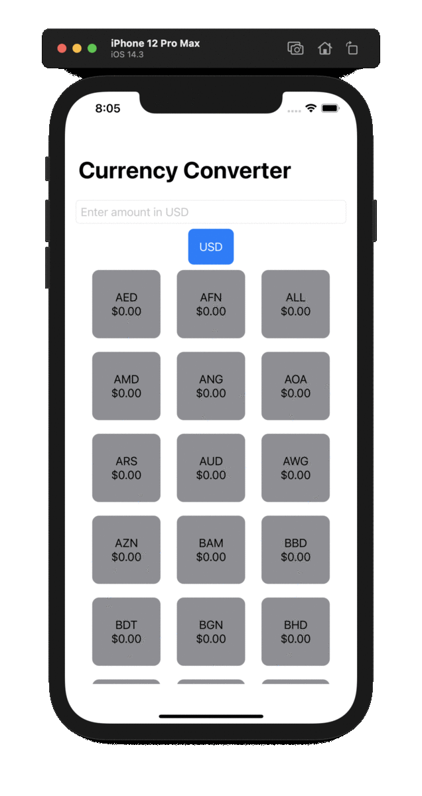

# CurrencyConverter
CurrencyConverter

Swift code for consuming open weather API's 

## Code
- Swift 5.0
- Minimum deployment target iOS 14.0 

## Build Requirements
 - **Xcode 12.3 (10A255)
 - Command Line Tools: Xcode 12.3.

## Available build configuration
- BaseURL	: (http://api.currencylayer.com/)

## Project Structure
- 📁 Views            : SwiftUi views 
- 📁 Utils	          : All required helper classes and extensions
- 📁 Models	          : All models
- 📁 Network          : All classes related to Network layer (URLSessions)
- 📁 ViewModels       : ViewModels for the views

##### Constraints
- It's not possible to debug using devices higher than iOS 14 (max version Xcode 12.3. supports)

